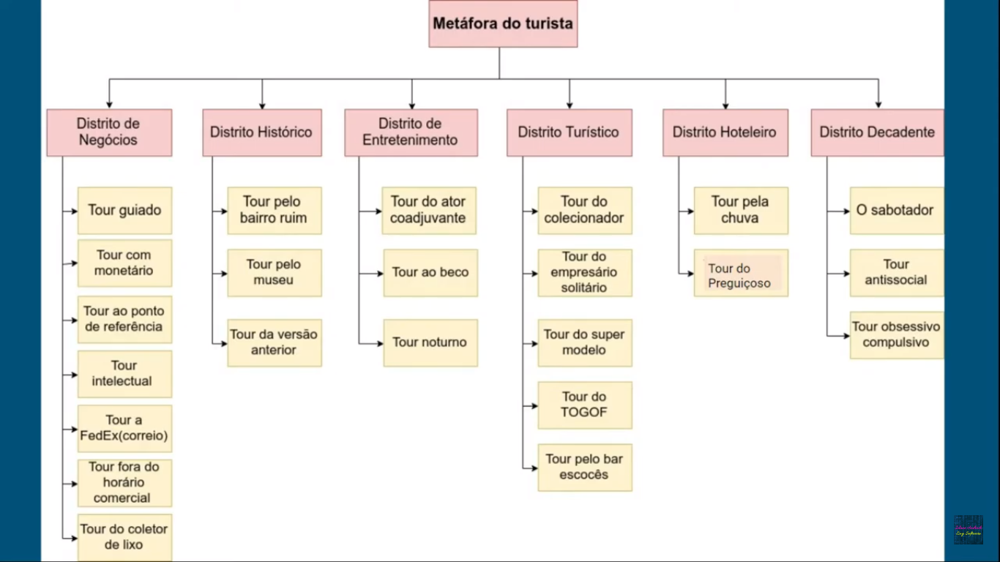

# Testes Exploratórios

Abordagem de aprendizagem simultânea. Simultâneo aprendizado, design e execução de testes; isto é, os testes não são definidos previamente em um plano de teste estabelecido, mas são dinamicamente projeto, executado e modificado. (SWEBOK)

"Pensamento científico em tempo real".

A eficiência do teste exploratório depende da experiência do testador. Para que essa abordagem funcione, é preciso que o testador conheça o comportamento esperado do sistema, que tenha familiaridade com a plataforma do sistema, o processo de falha (como é identificado), os tipos de falhas que o sistema pode gerar, o risco associado a cada falha e etc. Em outras palavras, é preciso que o testador saiba o que está fazendo e não saia simplesmente "explorando" sem um objetivo em mente.

## 1. Contextos de Uso

Exemplos de cenários em que os testes exploratórios podem ser utilizados:

* Quando é necessário um feedback ou apredizagem rápida do produto
* Quando não há disponibilidade de tempo para aplicações sistemáticas de testes.
* Auxiliar na investigação de fatores de riscos específicos.
* Maior diversidade de testes
* Na realização de teste de regressão baseados em relatórios de defeitos
* Na construção de testes a partir da perspectiva do usuário, originando-se de um manual de usuário, por exemplo.

## 2. O que podemos identificar nessa fase?

Além de bugs funcionais, podem ser identificados problemas de layout, UX, regras de negócios e outros.

| Vantagens | Desvantagens |
|-----------|--------------|
| Muito usado quando existe pouca ou nenhuma documentação | A sua eficiência depende da experiência/habilidade do testador |
| Aumentam as variações dos testes | Necessitam de certa experiência no domínio |
| Criam novos cenários para testes | Não devem ser levados como principal abordagem de teste |
| Incentiva a discussão do tima sobre os itens | - |

* Os testes exploratório não é livre de documentação, e sim são feitas ao longo do desenvolvimento dos testes.
* Devem possuir uma boa orientação e objetivo.

## 3. Metáfora do Turista (Whittaker)

A metáfora do turista apresentada por Whittaker faz uma alusão a um turista que visita uma grande cidade. Sem a preparação de um guia, é basicamente impossível conhecer a cidade em pouco tempo, pois há diversos lugares dignos de atenção. Ou seja, é extremamente importante possuir uma estratégia para que o tempo e os recursos sejam bem aproveitados e assim guiar as decisões. Nessa metáfora, o turista é o testador, a grande cidade é o sistema, e os lugares dignos de atenção são as diversas regiões do software que podem ser analisadas.

### 3.1. Planejamento / Estratégia 

Segundo Whittaker, o primeiro passo antes de iniciar o planejamento do teste do sistema é decompor o todo em partes menores para facilitar a gerência dos recursos.

A Metáfora do Turista sugere a decomposição baseada na inteção do testador, e não nas estruturas do sistema. Nessa abordagem, o turista irá dividir o seu plano de viagem de acordo com os distritos da cidade que pretende visitar.

Cada distrito possui uma inteção central relacionada, e é composto por tours que definem o que exatamente será "visitado" pelo turista.

### 3.2. Distritos

#### 3.2.1. Distrito de Negócios

O distrito de negócios faz alusão ao centro comercial de uma cidade. Onde durante um período de tempo está congestionada, com alto fluxo de pessoas. E durante outra parte do dia está vazia, sem pessoas circulando.

No software, seria as partes do sistema que possuem um horário de funcionamento, ou seja, tem a hora que está funcionando e hora que está indisponível.

##### 3.2.1.1. Tours (7)

###### 3.2.1.1.1. Tour Guiado

O tour guiado faz alusão ao tour clássico que os turistas fazem ao visitar uma cidade, com o pontos principais que mais aparecem nos guias de turismo.

Assim, o testador iria pegar o manual do usuário, e vai realizar as atividades lá descritas. O objetivo é executar cada cenário descrito no manual de forma a verificar se o software é capaz de executar o que está descrito no manual e também verificar se o manual está descrito de forma que represente a versão atual do sistema.

Deve-se ficar alerta a desvios de funcionalidades, e inconsistências no manual são exemplos de problemas que podem ser encontrados no tour guiado.

###### 3.2.1.1.2. Tour Monetário

Toda cidade possui um conjunto de atrações primárias que motivam os turistas a visitá-las (Orlando -> Parque da Disney, Las Vegas -> Hollywood, Las Vegas -> Cassinos). A metáfora com o software é que todo sistema tem um conjunto de funcionalidades chaves que motivaram o seu desenvolvimento.

O tour monetário busca verificar a coerência das funcionalidades da versão atual do produto com as especificações do sistema. Normalmente, a equipe de vendas é quem fornece as informações importantes para esse tour, pois geralmente são eles que detalham as especificações do produto durante suas vendas.

O objetivo desse tour é encontrar inconsistências no produto em relação a sua especificação. Os defeitos encontrados nesse tour seriam os mesmo que os usuários reais do sistema iriam encontrar, quando descobrissem que o produto que recebeu não é o que foi vendido.

Os passos para executar esse tour seria particiar de reuniões de vendas, assistir vídeos de marketing e analisar o que está sendo prometido aos clientes/usuários.

Após o entendimento do que é prometido (ou até mesmo especificado), o testador irá confrontar o sistema para verificar se ele é capaz de realizar o que é prometido/especificado.

###### 3.2.1.1.3. Tour ao Ponto de Referência (Landmark tour)

Segundo Whittaker, o turista ele deve saber exatamente onde quer chegar, para não se perder durante o trajeto, uma vez que pode encontrar outras atrações no caminho.

No contexto de testes exploratórios, o testador irá definir uma sequência de pontos de referências (funcionalidades do sistema) e irá executar os passos necessários para realizá-las, sequêncialmente. Dessa forma, o testador irá avaliar a interação de diferentes características do produto, quando executadas em diferentes sequências.

Um problema que pode surgir durante esse tour é quando uma sequência de passos interere na execução de uma atividade não correlata. Por exemplo, em um sistema é possível curtir e comentar uma foto individualmente. Porém após comentar uma foto, não é mais possível curtí-la.

Os passos para executar esse tour é definir uma lista de pontos de referências que serão visitados, definir uma ordem de visita, e visite os pontos observando se a ordem altera os fatores.

###### 3.2.1.1.4. Tour Intelectual

Na metáfora do turista, o tour intelectual faz alusão ao guia que tem em seu grupo um turista muito curioso que sabe mais do que a médio dos demais turistas. Esse turista curioso faz perguntas difíceis e coloca a todo momento em cheque o conhecimento do guia.

No contexto dos testes exploratório, o testador é o turista curioso, e ele é quem deve questionar o software, tentando por em cheque a lógica do sistema.

Esse tour pode detectar desde erros graves de lógica até erros simples de layout.

###### 3.2.1.1.5. Tour FedEx (Correio)

Na metáfora do turista, o FedEx é o responsável por levar os  "pacotes" de um lado a outro na cidade. Nos testes exploratórios, os pacotes são os dados que são movidos pelo software.

O objetivo desse tour é identificar problemas durante a manipulação dos dados pelo sistema. Esses problemas podem ser erros de conversão, pontos onde os dados se perdem, pontos onde os dados são duplicados, etc.

###### 3.2.1.1.6. Tour Fora do Horário Comercial (The After-Hours Tour)

Na metáfora do tursita, esse tour se refere a locais da cidade que após um certo horário não recebe mais turistas, porém mesmo sem turistas realizam certas atividades (manutenção, limpeza, etc.)

No contexto de teste exploratórios os locais das cidades são serviços que param de ser ofertados em um certo horário do dia, e as atividades são backup de dados, processamento de lote, manutenção do sistema etc.

O testador deve identificar esses locais no software e procurar por falhas nessas atividades.

###### 3.2.1.1.7. Tour do coletador de lixo (The Carbage Collector's Tour)

Na metáfora do turista, os coletadores de lixo são aqueles que melhor conhecem os caminhos pela cidade, uma vez que eles diariamente realizam percursos de forma metódica pela cidade.

No contexto de teste exploratório, o testador irá de forma metódica percorrer uma área do software realizando as tarefas rapidamente. Essas áreas do software podem ser: todas as opções do menu, todas as perguntas do formulário, todas as opções de pagamento, ...

O objetivo desse tour é fazer uma grande "varredura" o mais rápido possível para identificar problemas que são fácilmente identificados.

##### 3.2.1.2. Resumo dos Tours do Distrito de Negócios

* Sistemas que dependem da inicialização e desligamento prontos pra uso.
* 7 tours

| Tour guiado | Tour Monetário | Tour ao Ponto de Referência | Tour Intelectual |
|-------------|----------------|-----------------------------|------------------|
| Seguir manual no usuário | Verificar a coerência das funcionalidades de uma versão demonstrativa do produto com as especificações do sistema. | Orientação é fudamental | Trabalho sobre pressão |
| Executar cada passo descrito, sem desviar. | Razão para visitar a cidade, motivo para comprar o software. | Procure pontos de referência e percorra esses pontos na ordem estabelecida | É diferente para cada aplicação, faça perguntas difíceis para os testes de softwares. |
| Testa a precisão do manual. | Detecta se o que é vendido para os clientes do produto real. | Avaliar a interação entre diferentes caractrísticas do produto quando executado em diferentes sequências. | Detecta defeitos de alta complexidade e até mesmo defeitos simples. |
|  | Demonstrações de venda, de uso do produto | | |

| Tour FedEx | Tour fora do horário comercial | Tour Coletor de lixo |
|------------|--------------------------------|----------------------|
| Movimentação de dados entre entrada e saída. | Momento de trabalho de manutenção, backup, armazenamento de dados. | Avaliação metódica em blocos |
| Identificar cada característica que infleuncia ou sofre influência nos dados. | Identificar falhas resultantes da execução dessas atividades. | Cobrir determinado objetivo de forma metódica, não dependendo do tempo e verificando o mais óbvio. |
| Identificar possíveis pontos que esses dados são corrompidos no processamento. |  |  |

#### 3.2.2. Distrito Histórico

##### 3.2.2.1. Tours (3)

##### 3.2.2.1.1. Tour pelo bairro ruim

##### 3.2.2.1.2. Tour pelo museu

##### 3.2.2.1.3. Tour da versão anterior

##### 3.2.2.2. Resumo dos Tours do Distrito Histórico

* Tem como objetivo testar softwares legado.

| Tour pelo bairro ruim | Tour pelo museu | Tour da versão anterior |
|-----------------------|-----------------|-------------------------|
| Concentrar esforços de testes em áreas com mais concetrações de defeitos. | Código antigo (legado) | Uma vez que houve uma atualização, cenários das versões anteriores devem ser novamente executados. |
| À medida que o teste caminha, outras áreas podem ficar mais problemáticas. | Registros de alterações para consulta de códigos antigos, Código apresenta documentação pobre, alterações difíceis de serem feitas | Validar se a versão atualizada continua a funcionar de forma consistente em relação a anterior. |
| | Garantir que atualizações recentes sejam devidamente testadas. |  |

### Distrito de Entretenimento

* Testes que envolvem características que não são as principais, mas dão suporte à elas.
* Testes mais leves

| Tour do ator coadjuvante | Tour ao beco | Tour noturno |
|--------------------------|--------------|--------------|
| Caractrísticas periféricas | Locais não populares, indesejáveis, bastidores | Quanto tempo a aplicação pode durar em execução? Quanto tempo até entrar em colapso? |
| Concentração nas características que compartilham a tela com as outras características que serão mais utilizadas. | Testar características menos prováveis de serem utilizadas e menos atrativas do ponto de vista do usuário | Desafiar o software até ele falhar. |
| No decorrer, outras características ganham espaço para o usuário. | Exercitar características poucos exploradas do produto em testes. | Descoberta de erros de acesso à memória, corrompimento de dados, entre outros. |

### Distrito Turístico
* Pontos para turistas.
* Percursos curtos, teste breve com propósito simples.
* Visitação da funcionalidade.

| Tour do Colecionador | Tour do Empresário Solitário | Tour do Super Modelo |
|----------------------|------------------------------|----------------------|
| Experimentar as funcionalidades | Viagens sozinhas e hospedagem em lugares longes do aeroporto | Diz respeito sobre a aparência e primeiras impressões |
| Colecionar as saídas de software | Visitar/testar as características mais distantes | Foco na interface |
| Visitar todos os locais possíveis e produzir todas as saídas possíveis | Caminhos mais longos | Procurar por defeitos relacionados à interface e a forma que os elementos são apresentados |

| Tour do TOGOF | Tour pelo bar escocês |
|---------------|-----------------------|
| Relacionado ao Go gof - buy one, get one | Não estão localizados nos caminhos tradicionais |
| Tour simples projetado para testar várias cópias de uma mesma aplicação de forma simultânea | Feito para aplicações grandes e complicadas |
| Identificar possíveis problemas de concorrência e compartilhamento indevido de recursos | Verificar se as características mais difíceis de serem encontradas no produto funcionam corretamente |

### Distrito Hoteleiro
* Locais de descanso
* Oportunidade do testador deixar de lado as funcionalidades primárias e dar atenção às características de apoio ou ignoradas.

| Tour pela chuva | Tour do preguiçoso |
|-----------------|--------------------|
| Passeios interrompidos | Sempre existe o desinteressado |
| Uso do botão cancelar | Trabalhar o mínimo possível |
| Testar a não habilidade de limpeza do que foi iniciado | O software deve processar padrões de forma adequada e deve executar o código de manipulação de código em branco |

### Distrito Decadente
* Lugares desagradáveis, mas alguns optam por Visitar
* Testes que precisam ser feitos para que os usuários não passem por momentos incômodos

| O sabotador | Tour antissocial | Tour obsessivo compulsivo |
| - | - | - |
| Intenção de minar a aplicação de todas as maneiras possíveis| Direção oposta, se faz o oposto do que é esperado | Repetir, refazer, copiar a mesma ação várias vezes seguidas
| Procurar por defeitos relacionados com a falta ou escassez de produtos necessários para fazer a ação | Fornecer os dados de entrada menos prováveis e visam avaliar o comportamento do software| Verificar o comportamento do software com a mesma entrada repetida várias vezes
|| Testar capacidade de tratamento de erro da aplicação|
|  | Entradas de tipos errados | 
| | Testar se as mensagens de erro são devidamente mostradas|
|  | Realizar os testes na ordem errada |
|  | Verificar se as sequências inválidas de ações são impedidas pelo software| 

## Níveis de exploração em testes Exploratórios
### Estilo Livre (Freestyle)
O objetivo do teste é fornecido ao testador para que ele possa explorar livremente o sistema.

### Alto grau de exploração
Um ou mais grandes objetivos são fornecidos ao testador, porém o testador pode testar livremente.

### Grau médio de exploração
São fornecidos um ou mais grandes objetivos, entretanto são fornecidas restrições. Podem ser fornecidas fronteiras para limitar o trabalho do testador como objetivos, prioridades, riscos, ferramentas ou funcionalidade que o testador precisa se concentrar e que precisam ser cobertas.

### Baixo grau de exploração
São fornecidas informações e é necessário que alguns passos de testes sejam seguidos e o testador é incentivado a escolher os dados de teste a serem usados nas etapas de testes.

### Totalmente com script
é um teste onde são fornecidos os passos de teste e os dados de teste ao testador, desta maneira não sobra espaço para exploração.