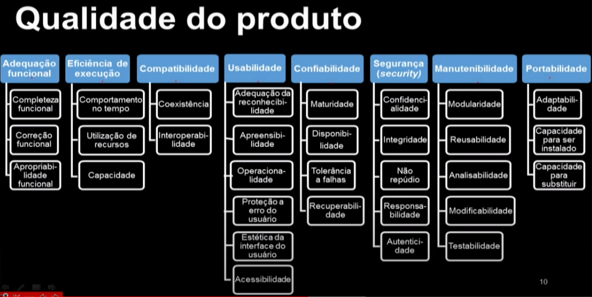

# Qualidade de Produto

*Qualidade é o grau em que o sistema, componente ou processo atende (1) os requisitos especificados e (2) as expectativas e necessidades do cliente ou usuário.*

* Como definir o grau? Como avaliá-lo?
* O que especificar? Como especificar?

### ISO 2500
* 5 divisões:
0. **Gerenciamento de Qualidade**: define os modelos, conceitos e termos comuns
1. **Modelo de Qualidade**: define os modelos de qualidade (produto, em uso e dados)
2. **Medição de Qualidade**: define um modelo de referência para medição e define métricas
3. **Requisitos de Qualidade**: ajuda a especificar requisitos de qualidade
4. **Avaliação da Qualidade**: define requisitos, recomendações e guias para avaliação.

## 1. Modelo de Qualidade
Definido de forma hierárquica (Característica -> subcaracterística -> propriedade de qualidade)
* Propriedades de qualidade: linhas de código, precisão de um cálculo, tempo de garantia, preço...
* As características/subcaracterísticas considera graus (o grau em que algo é atendido).

### Processo

**Considera diferentes visões de qualidade:**

### 1. Qualidade do Produto
* Ponto de vista do produto

*Características e subcaracterísticas*

### 2. Qualidade em Uso
* Ponto de vista do usuário
* Depende do contexto de uso
*Características e subcaracterísticas*

## Observações
* A importância depende do stakeholder
* É importante especificá-las precisamente(Medição)
